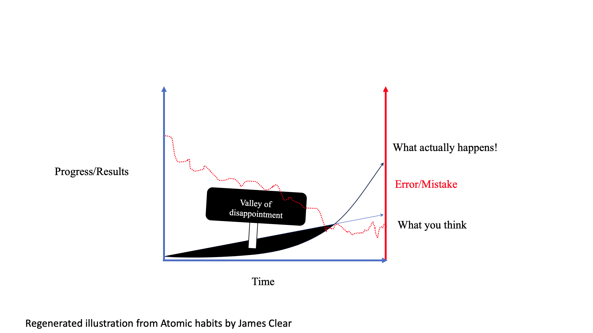
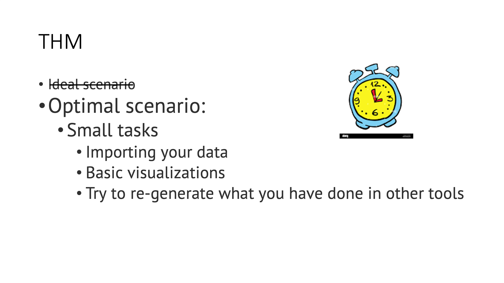
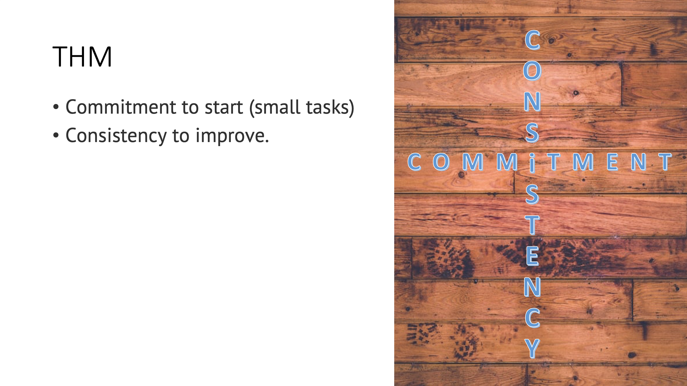
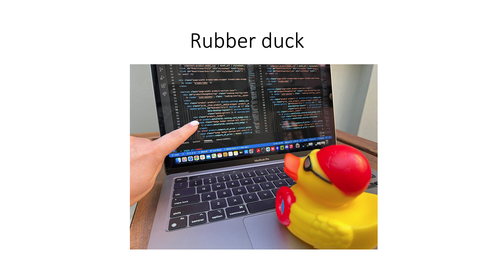

# Valley of Disappointment 
```{r slide1, echo = F}

```
&nbsp;  
&nbsp;  
&nbsp;  
&nbsp;  
&nbsp;  
&nbsp;  
&nbsp;  
&nbsp;   
&nbsp;  
&nbsp;    
```{r slide2, echo = F}

```
&nbsp;  
&nbsp;  
&nbsp;  
&nbsp;  
&nbsp;  
&nbsp;  
&nbsp;  
&nbsp;   
&nbsp;  
&nbsp;    
```{r slide3, echo = F}

```
&nbsp;  
&nbsp;  
&nbsp;  
&nbsp;  
&nbsp;  
&nbsp;  
&nbsp;  
&nbsp;   
&nbsp;  
&nbsp;    
```{r slide4, echo = F}

```
&nbsp;  
&nbsp;  
&nbsp;  
&nbsp;  
&nbsp;  
&nbsp;  
&nbsp;  
&nbsp;   
&nbsp;  
&nbsp;    
```{r slide5, echo = F}

```


# Survey
menti.com (7417 4931). 
https://www.menti.com/alt1s23cj7ie.  

&nbsp;  
&nbsp;  
&nbsp;  
&nbsp;  
&nbsp;  
&nbsp;  
&nbsp;  
&nbsp;   
&nbsp;  
&nbsp;    

# Introduction  
  - draw a table with index
    - Vector 
    - Matrix
    - Dataframe
    - Datatype (Numerical, Double, Character, Factors/Categorical)
  - c(), round()  

## Atomic vector numeric, letter  
```{r}
# c()
# round()
# letters
# sample
# %in% 

```

> **Challenge 1.2**  

## Indexing.  
```{r}

```

## Ordering elements. 
```{r}

```

## Conditional subsetting. 
```{r}
# ==, > , <
# & | 
# sample

```

> **Challenge 1.3**  

## Function  
```{r}

```
## Missing data  
```{r}
# is.na(), na.omit(), and complete.cases().

```

> **Challenge 1.4**  

- Do you have `data_raw` directory? 

```{r, message = FALSE, purl = FALSE}
## load the tidyverse packages, incl. dplyr
library(tidyverse)
```
When you load tidyverse:  
- dplyr: collection of tools to easily manipulate the data  
- tidyr: reshaping the data for plotting  
- ggplot2: for advanced plotting  
- tibble: modern dataframe  


**[`dplyr` cheatsheet](https://raw.githubusercontent.com/rstudio/cheatsheets/main/data-transformation.pdf)**      
**[`tidyr` cheatsheet](https://raw.githubusercontent.com/rstudio/cheatsheets/main/data-import.pdf)**  


```{r, eval=FALSE, purl=TRUE}
download.file(
  url = "https://nbisweden.github.io/module-r-intro-dm-practices/data/Hawks.csv",
  destfile = "data_raw/Hawks.csv"
)
```


read_csv from `tidyverse` package == read.csv from base R.  

```{r, echo = TRUE, eval = TRUE, purl = FALSE}
# silently read in CSV file with data
hawks <- read_csv("data_raw/Hawks.csv") #, col_names = T)
str(hawks)
```

When you execute `read_csv` on a data file, it looks through the first 1000 rows 
of each column and guesses its data type. Use the function `spec()` to view the
full column specification:

## Dataframes
columns = vector (datatype)

## Inspecting the dataframes

```{r, eval=TRUE,  purl=FALSE}
class(hawks)
view(hawks) 
hawks
head(hawks)
tail(hawks)
str(hawks)#structure
spec(hawks)
summary(hawks)

nrow(hawks)
ncol(hawks)
dim(hawks)
```

```{r}
hawks$CaptureTime[!is.character(hawks$CaptureTime)]
```


## Indexing and subsetting dataframes 

```{r, purl=FALSE}
# first element in the first column of the data frame
hawks[1, 1]   
# first element in the 6th column
hawks[1, 6]   
# first column of the data frame
hawks[, 1]    
# first column of the data frame
hawks[1]      
# first three rows of the 6th column
hawks[1:3, 6] 
# the 3rd row of the data frame
hawks[3, ]    
# equivalent to head_hawks <- head(hawks)
head_hawks <- hawks[1:6, ] 
# dropping column


# select columns by name
hawks$Month[1:6]
hawks[,'Month']
hawks[['Month']]
``` 

```{r}
hawks[1,c('Year', "ReleaseTime", 'Sex')]
sum(!is.na(hawks$Sex))

hawks_known_sex <- hawks[!is.na(hawks$Sex),]
dim(hawks_known_sex)
```

> **Challenge 2.2**  

## Factors  
Categorical data
```{r}

levels(hawks$Sex)
hawks$Sex <- factor(x = hawks$Sex, levels = c('M', 'F'), labels = c('Male', 'Female'))
levels(hawks$Sex)
summary(hawks$Sex)
```

> **Challenge 2.3**  

## Plotting
```{r fig.height = 6, fig.width = 6, fig.align = "center", purl = FALSE}
plot(hawks$Sex)
```

```{r}
sex <- hawks$Sex
levels(sex)
sex <- addNA(sex)
levels(sex)
levels(sex)[3] <- 'Unknown'
'Unknown1' -> levels(sex)[3] 
```

```{r barplot-1, fig.height = 6, fig.width = 6, fig.align = "center", purl = FALSE}
plot(sex)
```

> **Challenge 2.4**  

## Bonus

```{r}
x <- 1:10
exp_x <- exp(x)
plot(exp_x, type = 'l', xlab = 'time', ylab = 'progress')
lines(x * 500, col = 'red')
```

# Data manipulation
```{r}
hawks <- read_csv("data_raw/Hawks.csv") #, col_names = T)
```

## "I would like to ______ given columns"   


```{r}
select(hawks, Species, Sex, Weight)
select(hawks, -BandNumber, -Culmen)
```


## "I would like to ______ rows that satisfy a condition (e.g., column values equal a given value)"


```{r, purl = FALSE}
filter(hawks, Sex == "F")
```

We can also filter rows that do not contain missing data in some columns:

```{r, purl = FALSE}
filter(hawks, !is.na(Sex) & !is.na(Weight))
```

This will return all rows that have a value in both the `Sex` column and the
`Weight` column. In **`Tidyverse`**, there is also a special functions `drop_na` 
that can be used to filter out rows with missing data:

```{r, purl = FALSE}
drop_na(hawks, Sex, Weight)
```


## Pipes (`%>%`)

Ctrl + Shift + M
Cmd + Shift + M


x %>% f ==> f(x)
x %>% f(y) ==> f(x,y)


```{r}
hawks[1:5,]
head(hawks, n = 5)
hawks %>% head(n = 5)
hawks %>% head(n=5) %>% tail(n=1)

hawks %>%
  filter(Sex == "F" | Weight > 500) 
```

> **Challenge 3.1**

## "I would like to ______ new columns derived from existing columns (e.g., perform calculations or transformations)"
- mutate    
- color  
- transpose  


Frequently you'll want to create new columns based on the values in existing
columns, for example to do unit conversions, or to find the ratio of values in two
columns. For this we'll use `mutate()`.

```{r, purl = FALSE}
colnames(hawks)
hawks %>%
  mutate(Weight_kg = Weight / 1000)
```

You can also create a second new column based on the first new column within the same call of `mutate()`:

```{r, purl = FALSE}
hawks %>%
  mutate(Weight_kg = Weight / 1000,
         Weight_lb = Weight_kg * 2.2)
```

The first few rows of the output are full of `NA`s, so if we wanted to remove
those we could insert a `filter()` in the chain:

```{r, purl = FALSE}
hawks %>%
  filter(!is.na(Weight)) %>%
  mutate(Weight_kg = Weight / 1000) %>%
  head()
```


> **Challenge 3.2**

## Split-apply-combine data analysis 

Many data analysis tasks can be approached using the *split-apply-combine*
paradigm: split the data into groups, apply some analysis to each group, and
then combine the results. **`dplyr`** makes this very easy through the use of
the `group_by()` function.

### "I would like to ______ my data into a summary statistic (e.g., mean, sum, count)"
- delete 
- summarize  
- duplicate  


```{r, message = FALSE, purl = FALSE}
hawks %>% 
  group_by(Sex) %>%
  summarize(mean = mean(Weight, na.rm = TRUE))
```

You can also group by multiple columns:
```{r, message = FALSE, purl = FALSE}
hawks %>%
  group_by(Species, Sex) %>%
  summarize(mean = mean(Weight, na.rm = TRUE))
```

More metrics 
```{r, message = FALSE, purl = FALSE}
hawks %>%
  group_by(Species, Sex) %>%
  summarize(mean = mean(Weight, na.rm = TRUE),
            min = min(Weight, na.rm = TRUE))
```

### "I would like to ______ rows based on the values in one or more columns (e.g., sort them in ascending or descending order)" 
- copy 
- delete 
- arrange  


It is sometimes useful to rearrange the result of a query to inspect the values.
For instance, we can sort on `min` to put the lowest numbers first:

```{r, message = FALSE, purl = FALSE}
hawks %>%
  group_by(Species, Sex) %>%
  summarize(mean = mean(Weight, na.rm = TRUE),
            min = min(Weight, na.rm = TRUE)) %>% 
  arrange(min)
```

```{r, message = FALSE, purl = FALSE}
hawks %>%
  group_by(Species, Sex) %>%
  summarize(mean = mean(Weight, na.rm = TRUE),
            min = min(Weight, na.rm = TRUE)) %>% 
  arrange(desc(min))
```

### "I would like to ______ the number of occurrences for each unique value in a column" 
- reverse
- count  
- select


When working with data, we often want to know the number of observations found
for each factor or combination of factors. For this task, **`dplyr`** provides
`count()`. For example, if we wanted to count the number of rows of data for
each Sex, we would do:

```{r, purl = FALSE}
hawks %>%
  count(Sex) 
```

The `count()` function is shorthand for something we've already seen: grouping
by a variable, and summarizing it by counting the number of observations in that
group. In other words, `hawks %>% count(Sex)` is equivalent to:  

```{r, message = FALSE, purl = FALSE}
hawks %>%
  group_by(Sex) %>%
  summarize(n = n())
```

We can also combine `count()` with other functions such as `filter()`. Here
we will count the number of each species with weights above 800 g.

```{r, purl = FALSE}
hawks %>%
  filter(Weight > 500) %>%
  count(Species)
```

The example above shows the use of `count()` to count the number of
rows/observations for *one* factor (i.e., `Species`). If we wanted to
count *combination of factors*, such as `Species` and `Sex`, we would
specify the first and the second factor as the arguments of `count()`:

```{r purl = FALSE}
hawks %>%
  filter(Weight > 500) %>%
  count(Species, Sex)
```

With the above code, we can proceed with `arrange()` to sort the table according
to a number of criteria so that we have a better comparison. For instance, we
might want to arrange the table above in (i) an alphabetical order of the levels
of the sex and (ii) in descending order of the count:

```{r purl = FALSE}
hawks %>%
  filter(Weight > 500) %>%
  count(Species, Sex) %>% 
  arrange(Sex, desc(n))
```


> **Challenge 3.4**


## Exporting the data 
```{r}
# Filter out observations
hawks_rt_f <- hawks %>% 
  filter(Species == "RT" & Sex == "F")
write_csv(hawks_rt_f, file = "data_processed/Hawks_Red-Tailed_female.csv")
```

