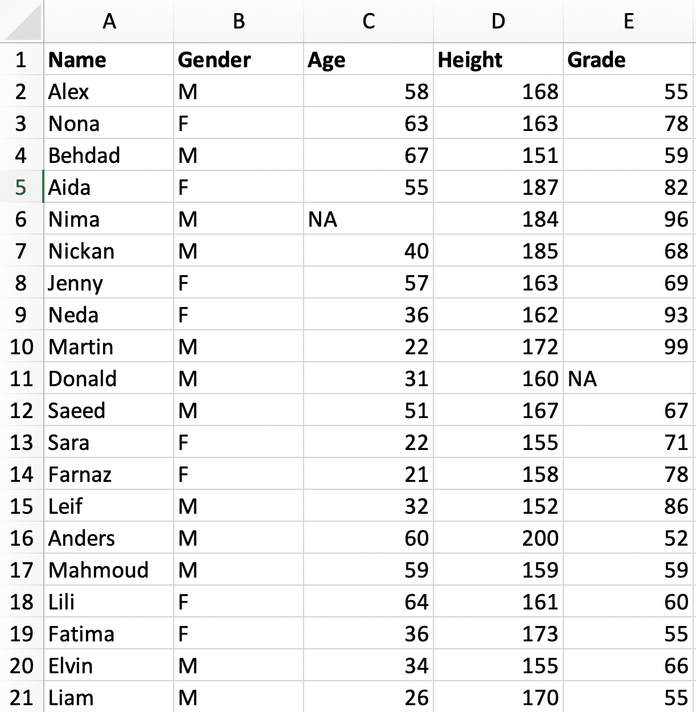

```{r, echo = F}
library(knitr)
```

# Introduction
In this tutorial we will learn how to use R by using examples fro excel environment. Many of us have been using excel for any different purposes. With excel we can organise the data, plot, and even do some statistical analysis. However, there are some limitations. We cannot run some complex analysis such as running linear models, or creating multipanel plots,..... Using VBA you can force excel to use some of the statistical models but you need to code in visual basic environment and it is not meant to do only statistical model. Moreover, it may become more complicated. From reproducibility point of view R has definitely more potential than excel. Last but not least when it comes to publication, sharing the analysis by any codes (inculding R) is more popular.  
# Data type
Regardless of which tool we use, we can categorize data in following groups:  
- Integer: Numbers   
- Logical: True or False   
- Character: text (Names)  

We store our data in variables which dependent on data format we can save it as vector, matrix, data frame, or list which you will learn about them in next section.  

# Vector and Matrix and data frames
In an excel sheet you have rows and columns. Since begining of 2000s excel sheet has 1048576 rows and 16384 columns. If you do not remember it used to be much less cells available in older versions.  Although it is a big number but sometimes we may have larger files which we cannot use excel. Although such files may be large to load in R but still there are some solutions for that. As an alternative to R you can use python, perl,.... by which you do not need to load any file.  
Now let's have an example in excel and try to replicate it in R. As you know an excel sheet is like a big matrix. Columns are named by letters and rows by numbers. 
```{r out.width = "30%", fig.cap ="A matrix with 20 rows (without header row) and five columns.", echo = F}

```

Now we create four vectors (Name, Gender, Age, Height, Grade) and save them as four variables. We can create variable as follows using assignment operator (<-), which you can replace by equal (=) but in order not to confuse them when we set parameters in functions it's better to use assignment operator (<-).   

```{r vector_matrix, eval = T, echo = T}
Name <- c("Alex",	"Nona",	"Behdad",	"Aida",	"Nima",	"Nickan",	"Jenny",	"Angela",	"Martin",	"Donald",	"Saeed",	"Sara",	"Farnaz",	"Leif",	"Anders",	"Mahmoud",	"Lili",	"Fatima",	"Elvin",	"Liam")
Gender <- c("M",	"F",	"M",	"F",	"M",	"M",	"F",	"F",	"M",	"M",	"M",	"F",	"F",	"M",	"M",	"M",	"F",	"F",	"M",	"M")
Age <- c(58,	63,	67,	55,	NA,	40,	57,	36,	22,	31,	51,	22,	21,	32,	60,	59,	64,	36,	34,	26)
Height <- c(168,	163,	151,	187,	184,	185,	163,	162,	172,	160,	167,	155,	158,	152,	200,	159,	161,	173,	155,	170)
Grade <- c(55,	78,	59,	82,	96,	68,	69,	93,	99,	NA,	67,	71,	78,	86,	52,	59,	60,	55,	66,	55)
```

It is important to look into summary statistic of our data such as frequency,  average, standard deviation,.....  
We first check the nummber of observation in each vector. 
```{r, eval = T, echo = T}
Name
length(Name) 
```
You can always check the help of functions in R by ```?length```.  
**Quetion** What is the data type in _Name_ vector? 


```{r}
class(Name)
typeof(Name)
```

Now, it is time to create a matrix where we can put together all of the vectors. Frist we create a matrix with 20 rows and five columns.    
```{r}
my_matrix <- matrix(data = 1:20, nrow = 20, ncol = 5, byrow = F)
my_matrix
```
**Question** Try matrix function by setting ```byrow = T ```, what is the difference?  

Similar to excel each cell/element has an adress in a matrix. Rows have numbers and columns, unlike excel sheet, have too.  For instance to look the content of the cell/element located in first row and first column we use ```my_matrix[1,1]```.  

```{r}
my_matrix[1,1]
```
**Question** Extract fifth element of each column, in other words what are the values in fifth row in all columns?  

**Question** Replace following elements: [1,1], [1,5] ,[20,2], all elements in second _row_? Can you also replace all the values in 4th _column_? 


Now we want to replace the data with vectors we created.  First check the data type of _my_matrix_.  
```{r}
my_matrix[,1] <- Name
my_matrix[,2] <- Gender
my_matrix[,3] <- Age
my_matrix[,4] <- Height
my_matrix[,5] <- Grade
my_matrix
```

**Question** Now check data type of _my_matrix_. What do you see?  

For multidimonsional data we can create data frame. Another advantage of data.frame is that we can assign column names when creating the data.frame.  
```{r}
df <- data.frame(Name = Name,
                 Gender = Gender,
                 AGE = Age,
                 Heigth = Height,
                 Grade = Grade)
df
```

We can change the header by _colnames_.  
```{r}
colnames(df)
colnames(df)[3] <- 'Age'
colnames(df)
```

We can access each column of a data.frame by "$".  
```{r}
df$Gender
df$Name
```

# Summary statistics
We continue with checking the statsitics of our data. We start by taking average of _Height_ by doing it manually before using _mean_ function. We know that there are 20 observations/samples. Thus we first sum the values and divide them by 20.  
$$\sum_{n=1}^{20} n / 20 $$  

```{r}
sum(Height)/length(Height)
```
Now let's use _mean_ function.  
```{r}
mean(Height)
```

**Question** What is the average value for Age, Grade? Do you get "NA" instead? Why? 
```{r, eval = F}
mean(Age, na.rm = T)
```


