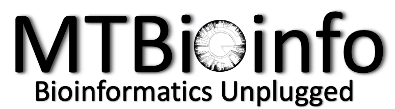

# My Toolbox in Bioinformatics
This is a repository consisting of codes and materials for My Toolbox in Bioinformatics. 
- [Packaging and sharing data science applications as Docker container images workshop at SBW 2024 by Scilife Lab Data Center](./Docker/Docker.html)
- [Nextflow notes](./Nextflow/Nextflow_Notes.html)
- [Kaggler Gemini course summary](./Python/Summary_Gemini_AI.ipynb)
- [Git tricks](./git/Git_Tricks.md)
# scRNASeq/Spatial papers  
- [Resources](https://github.com/nimarafati/My_Toolbox/blob/main/scRNASeq/Resources.md#spatialscrnaseq)  
